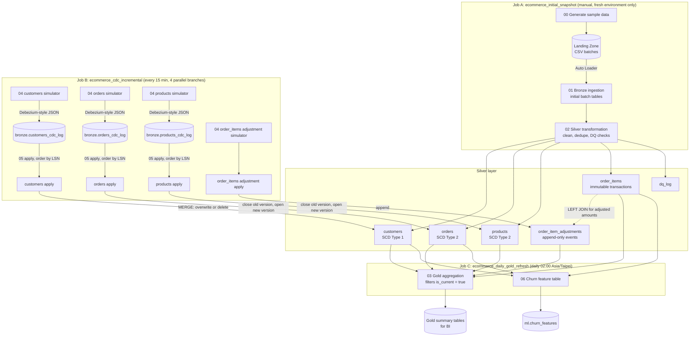

# Ecommerce ETL — Job Scheduling and CDC Architecture

## Project Overview

This project demonstrates a complete Medallion Architecture (Bronze → Silver → Gold) e-commerce data pipeline. Its core highlight: **it applies a change data capture (CDC) strategy suited to the semantics of each dimension table**, rather than using the same pattern for every table. This reflects a judgment that is often overlooked but matters in practice in data engineering: **the same CDC technique is not appropriate for every table**.

---

## Architecture Overview

The diagram below shows how data flows through the three Jobs described in Section 4. (GitHub renders the Mermaid diagram automatically.)



Key points:

- `silver.customers`, `silver.orders`, and `silver.products` are maintained by **both** paths: Job A fills them once with the initial batch load, and Job B keeps them up to date with CDC afterwards.
- `silver.order_items` is never updated by CDC. Returns and adjustments go into `silver.order_item_adjustments` instead.
- Job C runs `03` first and then `06`, and is decoupled from the 15-minute CDC cadence.

---

## 1. CDC Strategy by Table

| Table | Strategy | Business Rationale |
|---|---|---|
| **customers** | SCD Type 1 | Customer data (address, membership status, etc.) only matters in its *current* state. Changes overwrite the existing record, and no history is kept. |
| **orders** | SCD Type 2 | The history of order status changes (pending payment → shipped → completed) is directly valuable for SLA analysis, funnel analysis, and diagnosing shipping delays, so the full timeline of every status change is preserved. |
| **products** | SCD Type 2 | Product prices and categories change over time. If only the latest price is kept, back-calculating revenue/margin for historical orders becomes inaccurate, so every historical version of each change is preserved. |
| **order_items** | **No overwrite-style CDC**; uses a separate **adjustment event table** instead | Order items represent completed transactions, and in real financial/e-commerce systems the original transaction record is generally immutable. Changes such as returns or quantity adjustments should not UPDATE the original line item; instead, a separate append-only event table records the change, and the original transaction stays untouched. |


### Why This Classification: A Consistent Decision Rule

> Dimensions whose history is needed for analysis (order status flow, product prices) use SCD Type 2. Dimensions where only the current result matters (current customer data) use SCD Type 1. Records that represent completed transactions and must not be tampered with (order line items) step outside the SCD framework entirely and use a separate event table pattern.

This design choice itself demonstrates the judgment that "dimension data" and "transaction records" call for different governance strategies, rather than mechanically applying the same CDC template to every table.

---

## 2. Implementation Differences: SCD Type 1 vs. Type 2

**SCD Type 1 (customers)**

```sql
MERGE INTO silver.customers t USING dedup_events s
ON t.customer_id = s.customer_id
WHEN MATCHED AND s.op = 'd' THEN DELETE
WHEN MATCHED AND s.op IN ('c','u') THEN UPDATE SET *, t._cdc_lsn = s.lsn
WHEN NOT MATCHED AND s.op != 'd' THEN INSERT *
```

A single MERGE does the whole job; old data is overwritten in place and no history is kept.

**SCD Type 2 (orders / products)**

Each change requires two steps:

1. **Close the old version**: find the record where `is_current = true`, set its `valid_to` to the time of this change, and set `is_current` to `false`.
2. **Open the new version**: insert a new record with `valid_from` set to the time of this change, `valid_to` set to a far-future default value, and `is_current` set to `true`.

The table schema gains three extra columns, `valid_from` / `valid_to` / `is_current`, and a single business key (`order_id` / `product_id`) maps to multiple historical records.

**order_items (separate event table pattern)**

The original `silver.order_items` is never modified. Instead, a new table `silver.order_item_adjustments` is added:

```
adjustment_id STRING
order_item_id STRING
adjustment_type STRING   -- 'return' / 'quantity_change' / 'price_correction'
quantity_delta INT
amount_delta DECIMAL
reason STRING
adjusted_at TIMESTAMP
source_lsn BIGINT
```

This table is append-only. To compute the true current quantity/amount of a line item, downstream queries LEFT JOIN the original `order_items` with this adjustment table and sum the deltas, rather than modifying the original data.

---

## 3. Bronze CDC Log Design: One Per Table, Not Merged

Each source table has its own independent CDC log (`bronze.customers_cdc_log`, `bronze.orders_cdc_log`, `bronze.products_cdc_log`), rather than being merged into a single unified log table.

**Rationale:**

- It mirrors the real-world Debezium convention of "one source table maps to one Kafka topic".
- Each table's CDC pipeline can be monitored and debugged independently without affecting the others.
- The `before`/`after` schemas differ substantially between tables (especially SCD2 tables, which need extra columns), and forcing them into one table would make the schema design awkward.

---

## 4. Job Scheduling Architecture

The original design chained all notebooks (including the one-time environment setup script) into a single linear daily-scheduled pipeline, which conflated three operations with different natures and different frequencies. The architecture after the split:

| Job | Contents | Trigger | Purpose |
|---|---|---|---|
| **A: `ecommerce_initial_snapshot`** | `00 → 01 → 02 → 03` | Manual (PAUSED) | Run for environment initialization, or when data needs to be rebuilt. |
| **B: `ecommerce_cdc_incremental`** | Four parallel CDC branches (see below) | Every 15 minutes | Simulates near-real-time change synchronization, matching the frequency at which Debezium/Lakeflow Connect continuously ingests CDC events in the real world. |
| **C: `ecommerce_daily_gold_refresh`** | `03 → 06` | Daily at 02:00 (Asia/Taipei) | Batch-recomputes the BI summary tables and the churn feature table, decoupled from the CDC frequency so that costly aggregations aren't recomputed every 15 minutes (a freshness vs. cost trade-off). |

> **Architecture note**: `00_generate_sample_data` was originally designed as a standalone script, kept out of any scheduled Job, to avoid stacking duplicate batches in the landing zone if it were triggered repeatedly. After actual deployment it was changed to be **included in Job A as the first task**. The reason is that the `CREATE CATALOG/SCHEMA/VOLUME IF NOT EXISTS` statements inside `00` are idempotent, and combined with Job A's usage premise ("run only on a brand-new or freshly cleared environment"), the two are self-consistent. **However, that premise must be strictly observed**: Job A should not be re-triggered on an environment where data has already been touched by Job B (CDC) (see Section 7, "Known Pitfalls"). If Job A needs to be re-run, the correct approach is to first clear the entire catalog with `DROP ... CASCADE` (which also clears the landing zone Volumes), rather than simply re-running the Job.

### The Four CDC Branches Inside Job B

```
Job B: ecommerce_cdc_incremental (every 15 minutes)
  ├── customers_cdc:    04_customers_cdc_simulator              → 05_customers_cdc_apply              (SCD1)
  ├── orders_cdc:       04_orders_cdc_simulator                 → 05_orders_cdc_apply                 (SCD2)
  ├── products_cdc:     04_products_cdc_simulator               → 05_products_cdc_apply               (SCD2)
  └── order_items_cdc:  04_order_items_adjustment_simulator     → 05_order_items_adjustment_apply     (separate adjustment event table, append-only)
```

The four branches are independent of one another and can run in parallel. Notebooks are named directly after the table (rather than with letter suffixes like `04a`/`04b`), which improves readability: you can tell which table a notebook belongs to just from its filename.

---

## 5. Deployment (Databricks Asset Bundles)

The project now uses **Databricks Asset Bundles (DAB)** for infrastructure-as-code (IaC) deployment, replacing the earlier manual approach of running `jobs create` one by one via the CLI. All Job definitions live in `databricks.yml` at the repository root, and notebooks and Job configuration are version-controlled together, so a single command can reproduce the whole environment.

### Prerequisites

- Databricks CLI (a version that supports the `bundle` command)
- A valid Databricks Personal Access Token

### Deployment Steps

```bash
# 1. Configure the CLI (only needed once)
databricks configure --token

# 2. Validate the bundle configuration
databricks bundle validate

# 3. Deploy (uploads notebooks/ to the workspace and creates the three Jobs defined in databricks.yml)
databricks bundle deploy -t dev

# 4. Run and verify in order
databricks bundle run job_a_initial_snapshot -t dev   # Initialize the environment (only on a brand-new environment)
databricks bundle run job_b_cdc_incremental -t dev    # Verify the CDC logic
databricks bundle run job_c_daily_gold_refresh -t dev # Verify the Gold recomputation
```

On first deployment, it is recommended to set `pause_status` to `PAUSED` for Job B and Job C in `databricks.yml`. Once the flow has been manually verified, change it to `UNPAUSED` and `deploy` again to activate the schedules. This avoids the verification runs colliding with scheduled trigger times (see Section 7).

---

## 6. Differences from a Real Production Environment (Architecture Decisions)

Currently, the four notebooks starting with `04` all use code to simulate the CDC events a source database would produce. When connecting to a real production PostgreSQL, the recommended approach is the **PostgreSQL connector in Databricks Lakeflow Connect**:

- It syncs directly through PostgreSQL's native logical replication mechanism, with no need to self-host Debezium/Kafka.
- Lakeflow Connect automatically handles the integration of "initial snapshot + subsequent incremental CDC", tracks replication progress, and can resume from the point of interruption after a disconnection.
- At that point, the `04` series simulator tasks would be replaced by a Lakeflow Connect ingestion pipeline, and the downstream logic of the `05` series (ordering, MERGE) would need essentially no changes.

**Practical limitation**: The Lakeflow Connect Postgres connector is currently still in Public Preview, requires applying for eligibility through your Databricks account team, and requires the ingestion gateway to be deployed inside your VPC with a private connection to the database and an allowlisted firewall. This means real Postgres CDC cannot be put into practice on **Databricks Free Edition**; the simulator strategy in this project is the most pragmatic way to validate the downstream logic (idempotent merge, SCD1/2, separate event table) under that constraint.

---

## 7. Known Pitfalls and Debugging Notes

Pitfalls encountered during actual development and deployment, recorded to avoid repeating them:

1. **Widget naming collisions**: `dbutils.widgets.text(name, default, label)` only applies the `default` value when the widget **does not already exist**. If a new notebook is created by copying an existing one and keeps the old widget names (e.g., both named `cdc_landing_path`), it may inadvertently inherit widget values left over in that session from the old notebook, causing data to be written to the wrong path (simulated products events were once mistakenly written into the orders landing folder). **Fix**: prefix each CDC notebook's widget names with the table name (e.g., `cdc_landing_orders_path`, `cdc_landing_products_path`).

2. **Volumes not created in advance**: An early version of `00_generate_sample_data` only created the `landing` Volume and missed the CDC-related `_checkpoints` and `cdc_landing`, causing `01_bronze_ingestion` and the CDC simulators to each fail with `UC_VOLUME_NOT_FOUND`. This has been fixed so that `00` creates all three Volumes at once.

3. **Serverless environment `client` version compatibility**: If `environments.spec.client` in the Job definition is set to an older version (such as `"1"`), some newly provisioned workspaces report `Invalid platform channel Client-1`; a newer version (`"3"`) is needed.

4. **Schema evolution of the `_cdc_lsn` column**: `_cdc_lsn` is added automatically via `ADD COLUMNS` the first time the CDC apply notebooks (the ones starting with `05`) run. **If Job B (CDC) has already run, and Job A (batch initialization) is later re-run on the same data, the MERGE statement in `02_silver_transformation` fails with `DELTA_MERGE_UNRESOLVED_EXPRESSION`, because the batch source data lacks this column.** This is also why Section 4 stresses that Job A may only run on a brand-new environment: it is inherently not idempotent against an already-evolved schema, so before re-running it, the catalog must be cleared and rebuilt together with it.

5. **Manual and scheduled triggers overlapping**: If a manual `run-now` / `bundle run` happens to coincide with Job B's scheduled trigger time (every 15 minutes on the hour mark), the two runs write to the same checkpoint / Silver tables at once, and one of them gets stuck waiting for the lock to release (not a failure, just slower; delays of 5–6 minutes were observed). Delta Lake's concurrent-write mechanism guarantees data consistency is not corrupted, but during testing it is recommended to pause the schedule first (`pause_status: PAUSED`) before manually verifying, to avoid unnecessary resource contention.

---

## 8. Known Simplifications and Future Improvements

- **Data quality gate**: Currently `dq_log` only records check results and does not yet halt downstream tasks based on a failure-count threshold. The next step is to insert a quality-check task between Silver and Gold that blocks downstream execution and sends an alert on failure.
- **Failure alerts**: None of the three Jobs has `email_notifications` or a Slack webhook configured yet; these will be added later.
- **Multi-environment parameterization**: Deployment targets are currently distinguished through `targets` in `databricks.yml`, but separate catalog and compute settings for dev/staging/prod are not yet truly differentiated.
- **Idempotency gap for `_cdc_lsn`**: The handling of the `_cdc_lsn` column in `02_silver_transformation` does not yet make batch initialization truly idempotent against an already-evolved schema (see item 4 in Section 7); fixing this is the next priority.
- **order_items adjustment event table** (`silver.order_item_adjustments`) is fully implemented and verified, covering the three adjustment types `return` / `quantity_change` / `price_correction`, and demonstrates a query that LEFT JOINs the original `order_items` with the adjustment table to compute the "adjusted true amount". In real systems, a returns flow usually involves downstream processes such as inventory replenishment and refund status tracking; this project focuses on the data modeling layer and does not wire up those downstream processes.
- **`03_gold_aggregation`** now applies an `is_current = true` filter when reading `orders`/`products`, to avoid double-counting historical SCD2 versions in revenue/sales statistics. This is the part of SCD2 tables that is most easily overlooked in downstream queries and the most error-prone; any newly added downstream query must remember to apply this filter.
- **CI/CD**: Not yet wired up. In the future, `databricks bundle validate` + `deploy` could be triggered automatically when a PR is merged.
- **Real Postgres CDC**: Requires upgrading to a paid tier and applying for Lakeflow Connect Preview eligibility (see Section 6).